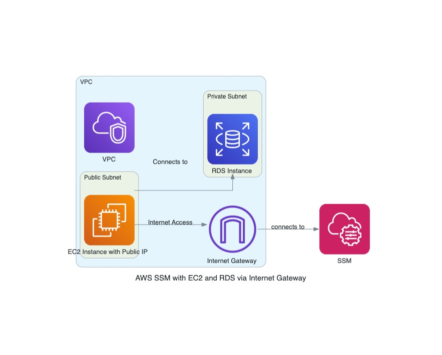

# AWS SSM Terraform Module

This project contains a Terraform module for managing AWS Systems Manager (SSM) resources.

## Features

- Manage SSM Parameters
- Configure SSM Document
- Set up SSM Maintenance Windows
- Automate resource management with Terraform

## Prerequisites

- [Terraform](https://www.terraform.io/downloads.html) installed
- AWS CLI configured with appropriate credentials
- AWS account with necessary permissions for SSM

## Architecture Diagram

Below is an architecture diagram illustrating the setup:

